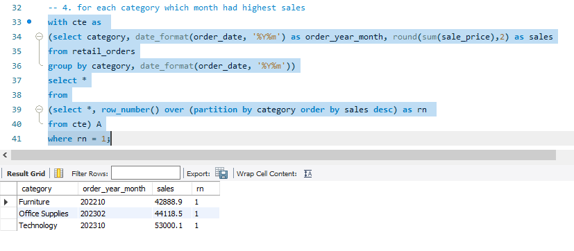

# Retail Orders Analysis using Python and MySQL

This project demonstrates how to perform data analysis on retail orders using **Python** (for data loading and cleaning) and **MySQL** (for analytics queries).

---

## 📑 Overview

Steps included in this project:
1. Download dataset from Kaggle to the local machine using Jupyter and pandas.
2. Data cleaning in Python.
3. Uploading the cleaned data into MySQL.
4. Performing advanced analysis directly in MySQL using SQL queries.

---

## 🗂️ Features & Analysis Performed

- **Top Revenue Products**: Identify the top 10 highest revenue-generating products.
- **Regional Best Sellers**: Top 5 highest selling products in each region.
- **Month-over-Month Growth**: Compare 2022 vs 2023 monthly sales.
- **Category Trends**: Find which month had the highest sales for each category.
- **Profit Growth**: Sub-category with the highest profit growth from 2022 to 2023.
- **Regional Sales Leaders**: Region with highest total sales each year.
- **Average Order Value (AOV)**: Identify category with highest AOV.
- **Sales Drop**: Sub-category with largest drop in sales from 2022 to 2023.
- **Top 3 Products per Category**: Most profitable products in each category.
- **Order Volume**: Month with the highest number of orders per region.
- **Cumulative Sales**: Running total of monthly sales for 2023.
- **Growth Rate**: Category with highest sales growth rate between 2022 and 2023.

---

## 🛠️ How to Use

1. Clone this repository:  
   ```bash
   git clone https://github.com/princedoobay/retail_orders_analysis
   ```
2. Use Jupyter Notebook to run the Python scripts:
   - Download the dataset.
   - Clean and preprocess data.
   - Upload cleaned data into MySQL.

3. Open MySQL Workbench and execute the provided SQL script for analysis.

---

## 🖼️ Sample Output Screenshots  

> Add screenshots of your Workbench or CLI output here:

- Top 10 highest reveue generating products  
  

- Highest monthly sales for each category  
  

- Region with highest total sales each year  
  

---

## 📝 Notes

- Make sure you have the MySQL server running.
- Ensure the `retail_orders` table is created in your MySQL database.
- Replace `https://github.com/princedoobay/retail_orders_analysis` with the actual GitHub repository URL.

---

## 📄 License

This project is open-source. You may use or modify it as needed.

## 👨‍💻 Author
Developed by **[Prince Doobay]**  
📧 Contact: prince.doobay@yahoo.com  
🌐 GitHub: [Your GitHub Profile](https://github.com/princedoobay)
